# UML Diagrams - Sakani Platform (منصة سكني)

## Generated Images
All images are saved in `public/uml/`:
- `use-case-diagram.png` - Use Case Diagram
- `class-diagram.png` - Class Diagram
- `sequence-diagram-rental.png` - Sequence Diagram (Rental Process)
- `sequence-diagram-handyman.png` - Sequence Diagram (Handyman Service)
- `sequence-diagram-admin.png` - Sequence Diagram (Admin Management)
- `activity-diagram.png` - Activity Diagram (Registration & Rental)
- `activity-diagram-admin.png` - Activity Diagram (Admin Operations)
- `state-diagram-contract.png` - State Diagram (Contract Lifecycle)
- `component-diagram.png` - Component Diagram
- `deployment-diagram.png` - Deployment Diagram
- `erd-diagram.png` - Entity Relationship Diagram

---

## 1. Use Case Diagram

> Updated to include comprehensive Admin dashboard, security, and platform management features.

```mermaid
graph TB
    subgraph "Sakani Platform - Use Cases"
        subgraph "Tenant Features"
            UC1["Search Properties"]
            UC2["Book Viewing"]
            UC3["Sign Contract"]
            UC4["Pay Rent / Arrabon"]
            UC5["Request Handyman"]
            UC6["Chat with Owner"]
            UC7["Submit KYC"]
            UC8["Manage Wallet"]
            UC9["Set Search Alert"]
            UC25["Compare Properties"]
            UC26["360 Virtual Tour"]
            UC27["AI Voice Search"]
        end

        subgraph "Owner Features"
            UC10["List Property"]
            UC11["Manage Contracts"]
            UC12["Review Tenants"]
            UC13["Track Payments"]
            UC14["View Analytics"]
            UC15["Feature Listing"]
            UC28["Upload Multi Images"]
            UC29["Export Contract PDF"]
        end

        subgraph "Agency Features"
            UC16["Manage Multiple Listings"]
            UC17["Agency Dashboard"]
            UC18["Subscribe to Package"]
        end

        subgraph "Admin Features"
            UC19["Verify KYC Documents"]
            UC20["Approve/Reject Payments"]
            UC21["Manage Reports & Flags"]
            UC22["View Demand Heatmap"]
            UC23["Manage Users & Roles"]
            UC24["Platform Statistics"]
            UC30["Manage Contracts Admin"]
            UC31["Process Support Requests"]
            UC32["Handle Role Change Requests"]
            UC33["Review Reported Properties"]
            UC34["Review Reported Handymen"]
            UC35["Security Audit & Scanning"]
            UC36["Manage Appointments"]
            UC37["Assign Admin Roles"]
        end
    end

    Tenant((Tenant))
    Owner((Owner))
    Agency((Agency))
    Admin((Admin))

    Tenant --> UC1
    Tenant --> UC2
    Tenant --> UC3
    Tenant --> UC4
    Tenant --> UC5
    Tenant --> UC6
    Tenant --> UC7
    Tenant --> UC8
    Tenant --> UC9
    Tenant --> UC25
    Tenant --> UC26
    Tenant --> UC27

    Owner --> UC10
    Owner --> UC11
    Owner --> UC12
    Owner --> UC13
    Owner --> UC14
    Owner --> UC15
    Owner --> UC3
    Owner --> UC28
    Owner --> UC29

    Agency --> UC16
    Agency --> UC17
    Agency --> UC18

    Admin --> UC19
    Admin --> UC20
    Admin --> UC21
    Admin --> UC22
    Admin --> UC23
    Admin --> UC24
    Admin --> UC30
    Admin --> UC31
    Admin --> UC32
    Admin --> UC33
    Admin --> UC34
    Admin --> UC35
    Admin --> UC36
    Admin --> UC37

    UC3 -.->|include| UC7
    UC4 -.->|include| UC8
    UC9 -.->|extend| UC1
    UC15 -.->|extend| UC10
    UC27 -.->|extend| UC1
    UC32 -.->|include| UC23
    UC33 -.->|include| UC21
    UC34 -.->|include| UC21
    UC37 -.->|include| UC35
```

---

## 2. Class Diagram

> Updated with Security, Admin, and Audit classes.

```mermaid
classDiagram
    class User {
        +UUID id
        +String email
        +String full_name
        +String phone
        +String role_type
        +String avatar_url
        +Boolean kyc_verified
        +Float avg_rating
        +Int total_reviews
        +String[] reputation_badges
        +JSON settings
        +register()
        +login()
        +updateProfile()
        +updateSettings()
    }

    class UserRole {
        +UUID id
        +UUID user_id
        +Enum role: admin|moderator|user
        +assignRole()
        +revokeRole()
    }

    class Property {
        +UUID id
        +String title
        +String description
        +Float price
        +String price_period
        +String city
        +String address
        +Int bedrooms
        +Int bathrooms
        +Float area_sqm
        +String property_type
        +Boolean is_available
        +String[] images
        +String[] amenities
        +Float latitude
        +Float longitude
        +create()
        +update()
        +delete()
        +search()
        +toggleAvailability()
    }

    class Contract {
        +UUID id
        +String title
        +String contract_type
        +Date start_date
        +Date end_date
        +Float monthly_amount
        +Float total_amount
        +String status
        +Boolean landlord_signed
        +Boolean tenant_signed
        +String landlord_signature_data
        +String tenant_signature_data
        +Boolean landlord_phone_consent
        +Boolean tenant_phone_consent
        +String terms
        +create()
        +sign()
        +terminate()
        +exportPDF()
        +givePhoneConsent()
    }

    class ServiceRequest {
        +UUID id
        +String service_type
        +String description
        +String status
        +Date preferred_date
        +String preferred_time
        +String address
        +Float estimated_price
        +Float final_price
        +Float latitude
        +Float longitude
        +Int handyman_rating
        +Int client_rating
        +create()
        +accept()
        +start()
        +complete()
        +cancel()
        +rateHandyman()
        +rateClient()
    }

    class KYCVerification {
        +UUID id
        +UUID user_id
        +String id_type
        +String id_front_url
        +String id_back_url
        +String selfie_url
        +String status
        +Date submitted_at
        +Date verified_at
        +String verified_by
        +String rejection_reason
        +submit()
        +verify()
        +reject()
    }

    class Handyman {
        +UUID id
        +UUID user_id
        +String[] specialty
        +String description
        +Float rating
        +Float hourly_rate
        +Boolean is_available
        +Float latitude
        +Float longitude
        +Int service_area_km
        +Int total_reviews
        +updateAvailability()
        +updateLocation()
    }

    class Review {
        +UUID id
        +UUID reviewer_id
        +UUID reviewed_id
        +UUID contract_id
        +Int rating
        +String comment
        +String reviewer_role
        +String[] badges
        +create()
    }

    class Bill {
        +UUID id
        +UUID user_id
        +String bill_type
        +String title
        +Float amount
        +Date due_date
        +String status
        +Boolean recurring
        +Int recurring_day
        +pay()
        +setReminder()
    }

    class Arrabon {
        +UUID id
        +UUID contract_id
        +UUID tenant_id
        +UUID owner_id
        +Float amount
        +String payment_method
        +String status
        +String payment_proof_url
        +String verified_by
        +submit()
        +verify()
        +release()
    }

    class PaymentHistory {
        +UUID id
        +UUID user_id
        +Float amount
        +String currency
        +String payment_method
        +String payment_type
        +String status
        +String payment_proof_url
        +String verified_by
        +String rejection_reason
        +verify()
        +reject()
    }

    class Report {
        +UUID id
        +UUID reporter_id
        +String reported_type
        +UUID reported_id
        +String reason
        +String description
        +String status
        +String admin_notes
        +UUID resolved_by
        +submit()
        +resolve()
        +dismiss()
    }

    class SupportRequest {
        +UUID id
        +UUID user_id
        +String request_type
        +String from_role
        +String to_role
        +String reason
        +String status
        +String admin_notes
        +UUID processed_by
        +submit()
        +approve()
        +reject()
    }

    class Notification {
        +UUID id
        +UUID user_id
        +String title
        +String message
        +String type
        +Boolean is_read
        +JSON data
        +send()
        +markRead()
    }

    class Conversation {
        +UUID id
        +UUID participant_1
        +UUID participant_2
        +UUID property_id
        +DateTime last_message_at
        +sendMessage()
    }

    class Message {
        +UUID id
        +UUID conversation_id
        +UUID sender_id
        +String content
        +Boolean is_read
    }

    class SearchAlert {
        +UUID id
        +UUID user_id
        +String name
        +String city
        +String property_type
        +Float min_price
        +Float max_price
        +Int min_bedrooms
        +Int max_bedrooms
        +Boolean is_active
        +create()
        +toggle()
        +checkMatches()
    }

    class AgencySubscription {
        +UUID id
        +UUID user_id
        +UUID package_id
        +String agency_name
        +String status
        +Date starts_at
        +Date expires_at
        +Boolean auto_renew
        +subscribe()
        +renew()
        +cancel()
    }

    class FeaturedListing {
        +UUID id
        +UUID property_id
        +Int duration_days
        +String feature_type
        +String status
        +Float price_paid
        +Date starts_at
        +Date expires_at
        +purchase()
        +activate()
    }

    class SecurityAuditLog {
        +UUID id
        +UUID user_id
        +String action_type
        +String resource_type
        +UUID resource_id
        +String ip_address
        +String user_agent
        +Boolean is_suspicious
        +Int risk_score
        +JSON location_data
        +log()
        +analyze()
    }

    class ThreatDetection {
        +UUID id
        +String threat_type
        +String severity
        +UUID user_id
        +String ip_address
        +JSON details
        +Boolean is_resolved
        +String action_taken
        +detect()
        +resolve()
    }

    class TwoFactorAuth {
        +UUID id
        +UUID user_id
        +String secret_key
        +Boolean is_enabled
        +String[] backup_codes
        +enable()
        +disable()
        +verify()
    }

    class EncryptedDataVault {
        +UUID id
        +UUID user_id
        +String data_type
        +String encrypted_data
        +String data_hash
        +Int encryption_version
        +store()
        +retrieve()
    }

    class DemandAnalytics {
        +UUID id
        +String city
        +String property_type
        +Date period_date
        +Int search_count
        +Int view_count
        +Int inquiry_count
        +Float avg_price
        +Float latitude
        +Float longitude
        +compute()
    }

    User "1" --> "0..*" Property : owns
    User "1" --> "0..*" Contract : as landlord
    User "1" --> "0..*" Contract : as tenant
    User "1" --> "0..1" KYCVerification : submits
    User "1" --> "0..1" Handyman : extends as
    User "1" --> "0..*" Conversation : participates
    User "1" --> "0..*" Notification : receives
    User "1" --> "0..*" SearchAlert : creates
    User "1" --> "0..1" AgencySubscription : subscribes
    User "1" --> "0..*" UserRole : has roles
    User "1" --> "0..*" Report : submits
    User "1" --> "0..*" SupportRequest : creates
    User "1" --> "0..*" PaymentHistory : records
    User "1" --> "0..1" TwoFactorAuth : configures
    User "1" --> "0..*" SecurityAuditLog : generates
    User "1" --> "0..*" EncryptedDataVault : stores

    Property "1" --> "0..*" Contract : subject of
    Property "1" --> "0..*" FeaturedListing : promoted by
    Property "1" --> "0..*" Report : reported

    Contract "1" --> "0..*" Bill : generates
    Contract "1" --> "0..*" Review : receives
    Contract "1" --> "0..*" Arrabon : secured by

    Handyman "1" --> "0..*" ServiceRequest : receives
    User "1" --> "0..*" ServiceRequest : as client

    Conversation "1" --> "0..*" Message : contains
```

---

## 3. Sequence Diagram - Property Rental Process

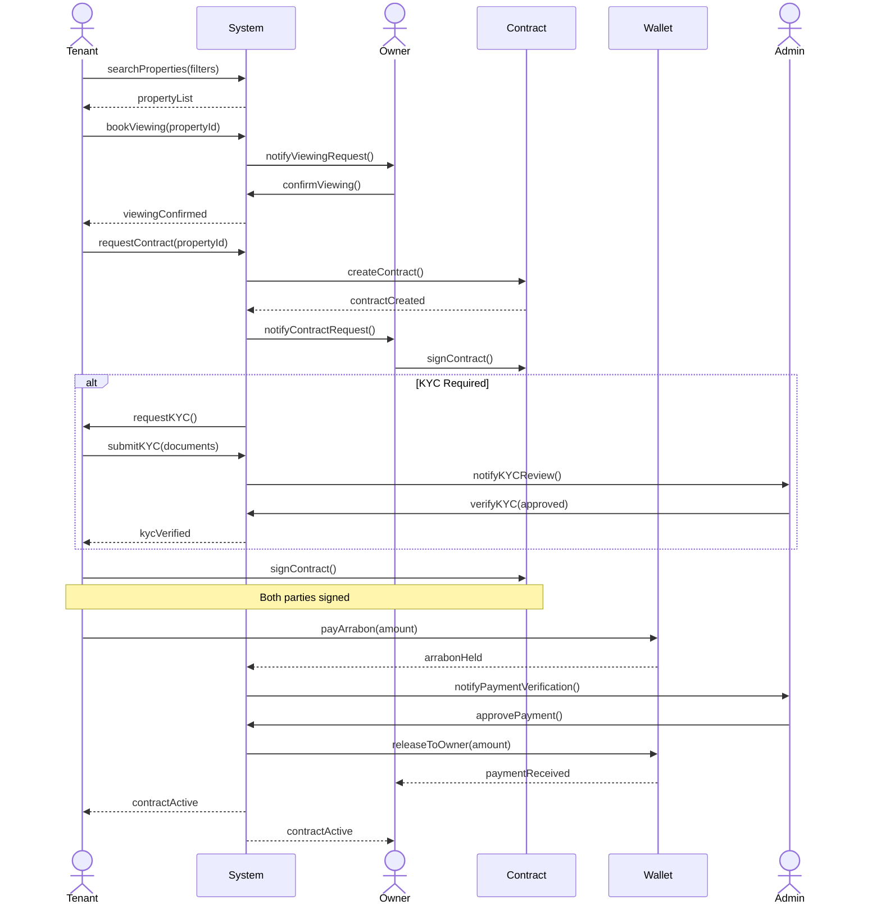

---

## 4. Sequence Diagram - Handyman Service Request

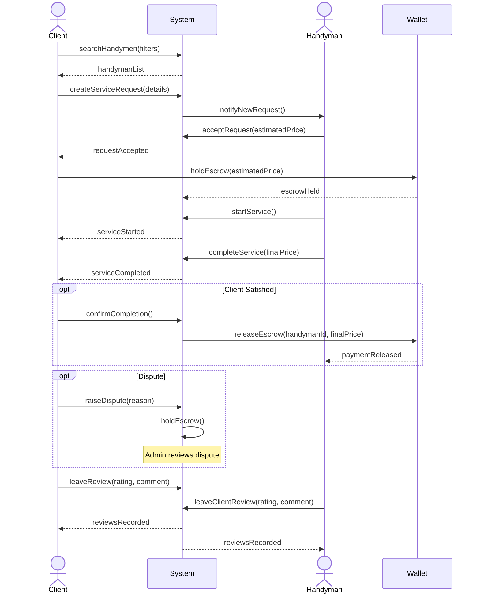

---

## 5. Sequence Diagram - Admin Dashboard Operations

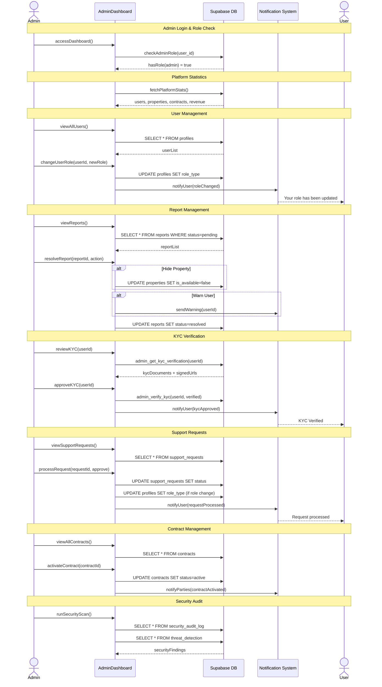

---

## 6. Activity Diagram - User Registration and Property Rental

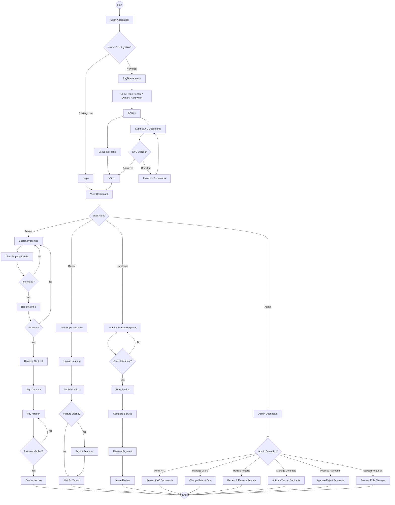

---

## 7. Activity Diagram - KYC Verification Process (Admin)

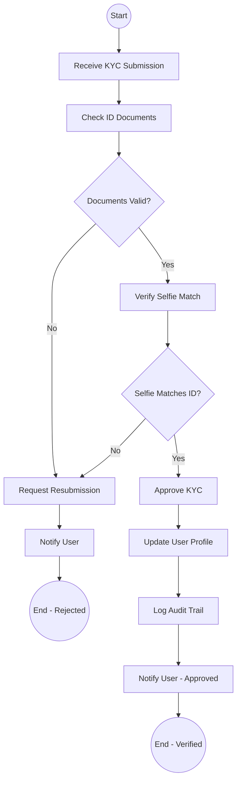

---

## 8. Activity Diagram - Admin Report Management

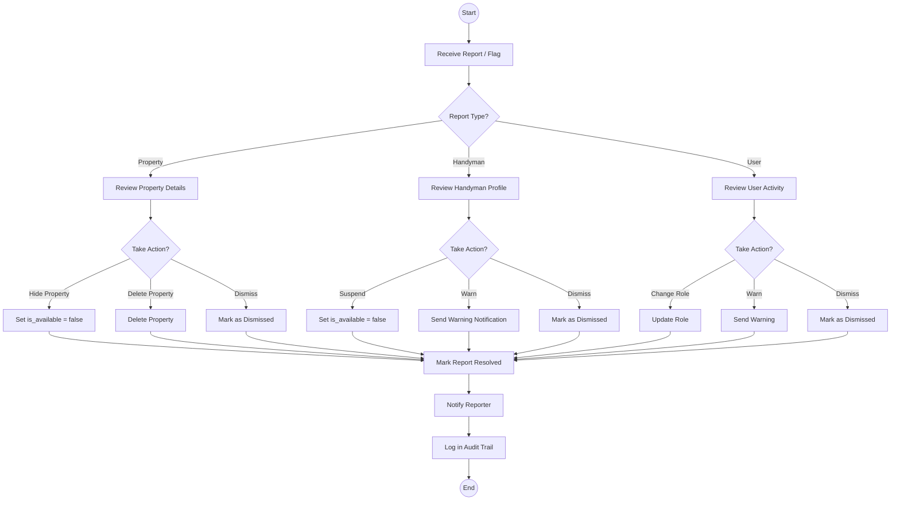

---

## 9. State Diagram - Contract Lifecycle

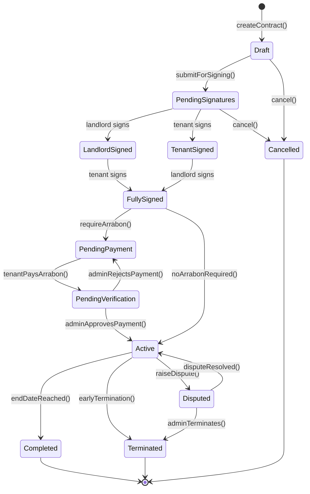

---

## 10. State Diagram - Service Request Lifecycle

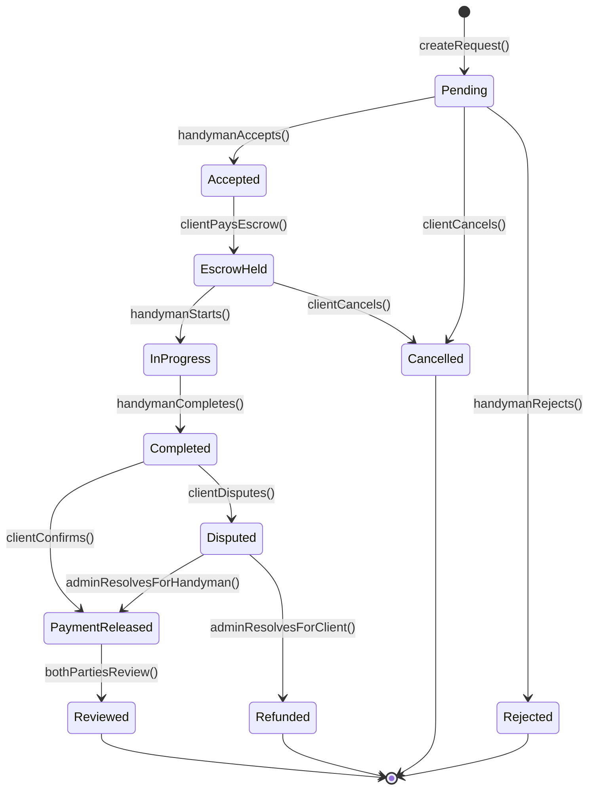

---

## 11. Deployment Diagram

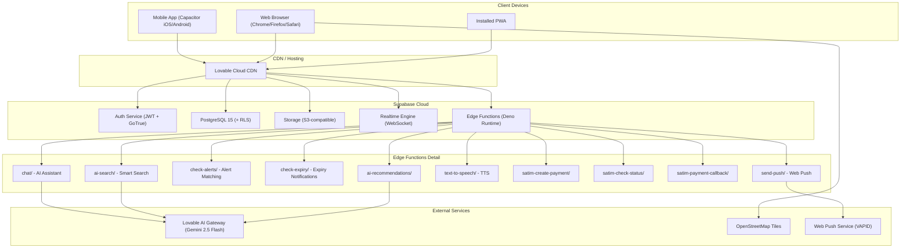

---

## 12. Component Diagram

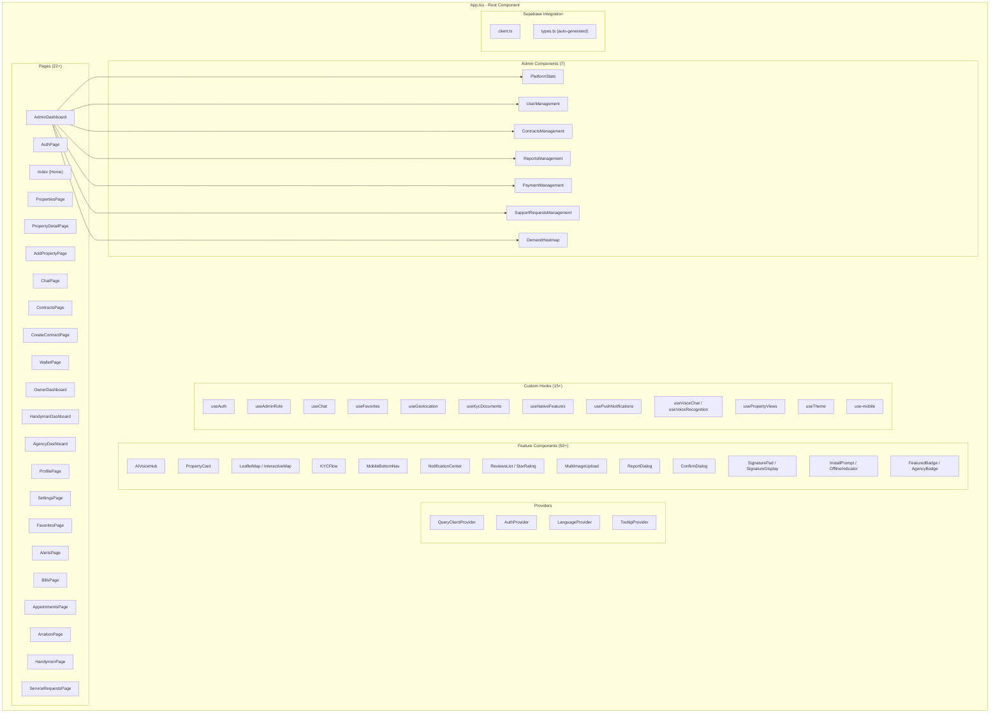

---

## How to Export as Images

1. **Mermaid Live Editor**: Go to https://mermaid.live, paste each diagram code, and export as PNG/SVG
2. **VS Code**: Install "Markdown Preview Mermaid Support" extension
3. **CLI**: Use `mmdc` (Mermaid CLI): `npx @mermaid-js/mermaid-cli mmdc -i input.md -o output.png`
