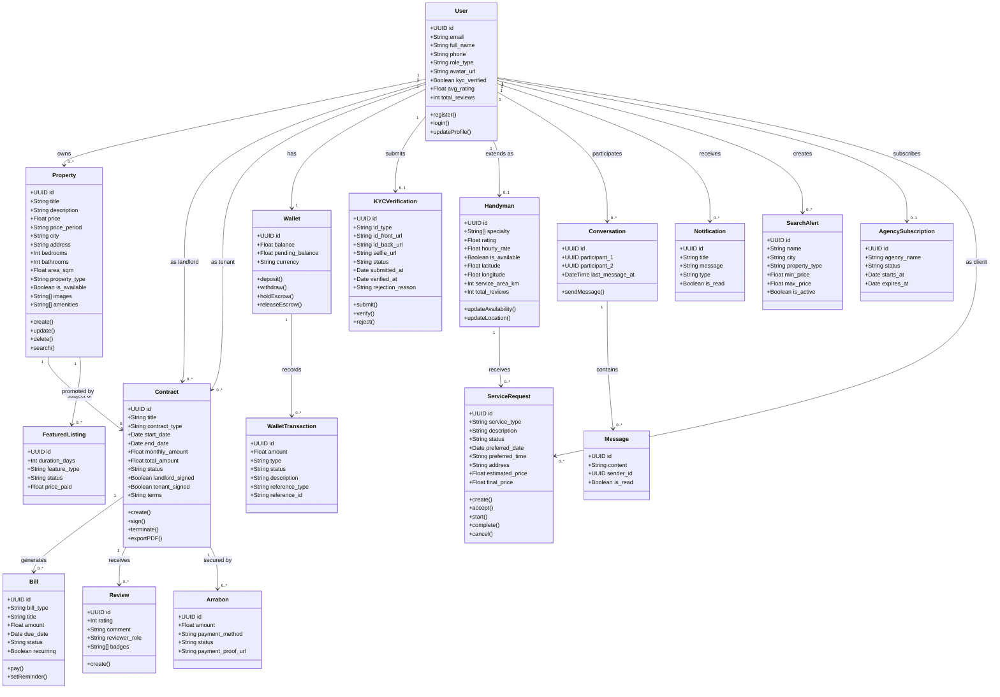
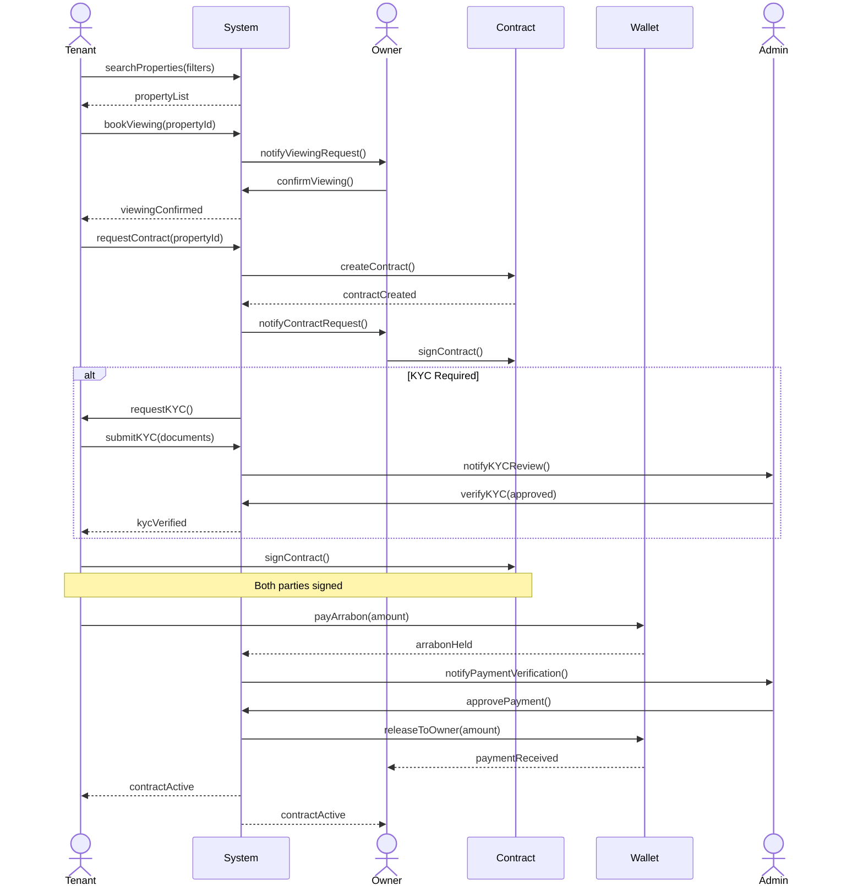
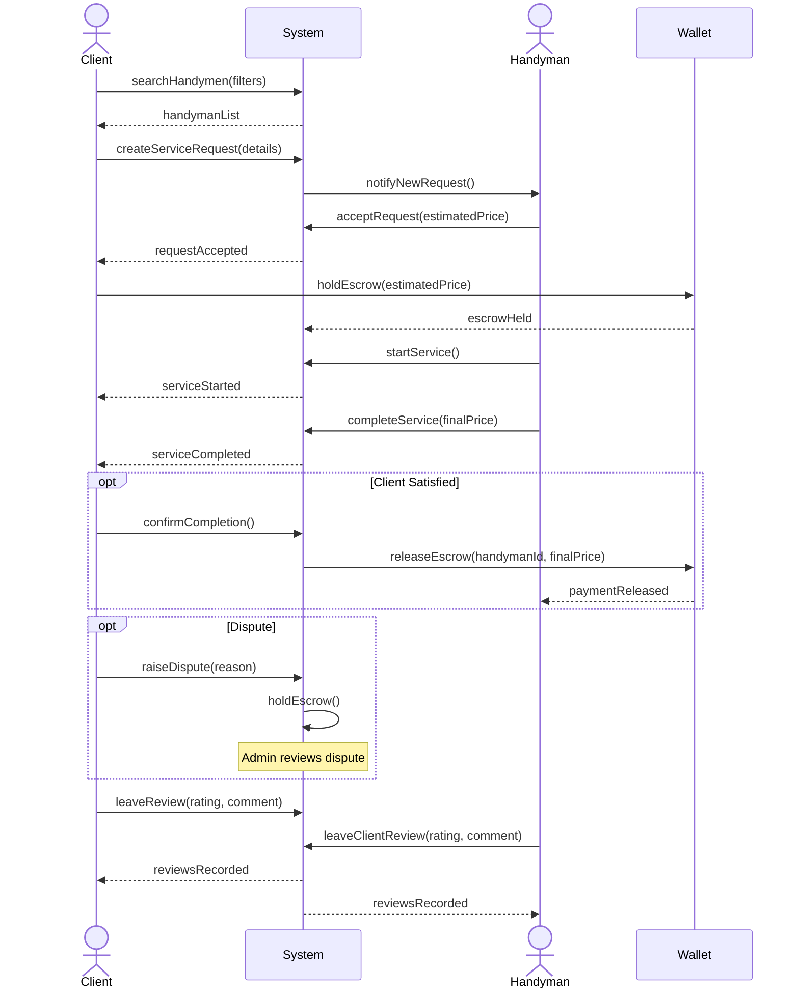
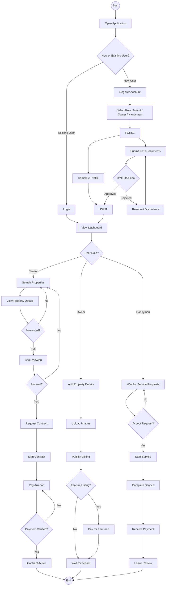
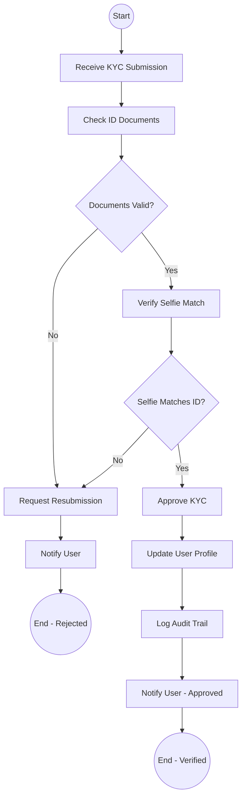

# UML Diagrams - Rental Property Management Platform

## Generated Images
All images are saved in `public/uml/`:
- `use-case-diagram.png` - Use Case Diagram
- `class-diagram.png` - Class Diagram
- `sequence-diagram-rental.png` - Sequence Diagram (Rental Process)
- `sequence-diagram-handyman.png` - Sequence Diagram (Handyman Service)
- `activity-diagram.png` - Activity Diagram

---

## 1. Use Case Diagram (Mermaid - Accurate Source)

> Copy this to https://mermaid.live or any Mermaid renderer for a clean export.

```mermaid
graph TB
    subgraph "Rental Property Management System"
        UC1["Search Properties"]
        UC2["Book Viewing"]
        UC3["Sign Contract"]
        UC4["Pay Rent"]
        UC5["Request Handyman Service"]
        UC6["Chat with Owner"]
        UC7["Submit KYC"]
        UC8["Manage Wallet"]
        UC9["Set Search Alert"]
        UC10["List Property"]
        UC11["Manage Contracts"]
        UC12["Review Tenants"]
        UC13["Track Payments"]
        UC14["View Analytics"]
        UC15["Feature Listing"]
        UC16["Manage Multiple Listings"]
        UC17["Agency Dashboard"]
        UC18["Subscribe to Package"]
        UC19["Verify KYC"]
        UC20["Approve Payments"]
        UC21["Manage Reports"]
        UC22["View Demand Heatmap"]
        UC23["Manage Users"]
    end

    Tenant((Tenant))
    Owner((Owner/Provider))
    Agency((Agency))
    Admin((Admin))

    Tenant --> UC1
    Tenant --> UC2
    Tenant --> UC3
    Tenant --> UC4
    Tenant --> UC5
    Tenant --> UC6
    Tenant --> UC7
    Tenant --> UC8

    Owner --> UC10
    Owner --> UC11
    Owner --> UC12
    Owner --> UC13
    Owner --> UC14
    Owner --> UC3

    Agency --> UC16
    Agency --> UC17
    Agency --> UC18

    Admin --> UC19
    Admin --> UC20
    Admin --> UC21
    Admin --> UC22
    Admin --> UC23

    UC3 -.->|include| UC7
    UC4 -.->|include| UC8
    UC9 -.->|extend| UC1
    UC15 -.->|extend| UC10
```

---

## 2. Class Diagram (Mermaid - Accurate Source)

---

## 3. Sequence Diagram - Property Rental Process

---

## 4. Sequence Diagram - Handyman Service Request

---

## 5. Activity Diagram - User Registration and Property Rental

---

## 6. Activity Diagram - KYC Verification Process (Admin)

---

## How to Export as Images

1. **Mermaid Live Editor**: Go to https://mermaid.live, paste each diagram code, and export as PNG/SVG
2. **VS Code**: Install "Markdown Preview Mermaid Support" extension
3. **CLI**: Use `mmdc` (Mermaid CLI): `npx @mermaid-js/mermaid-cli mmdc -i input.md -o output.png`
